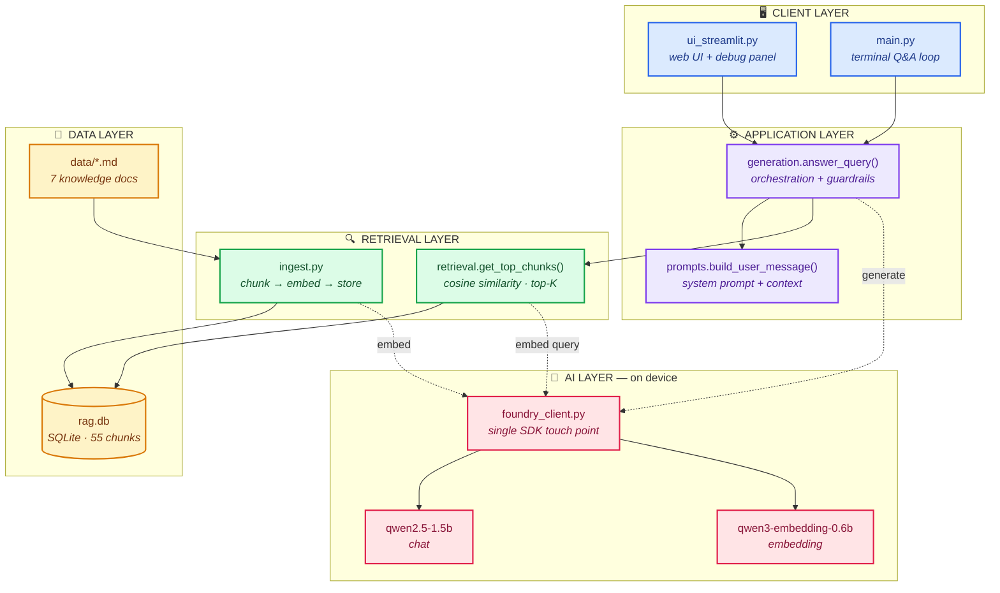
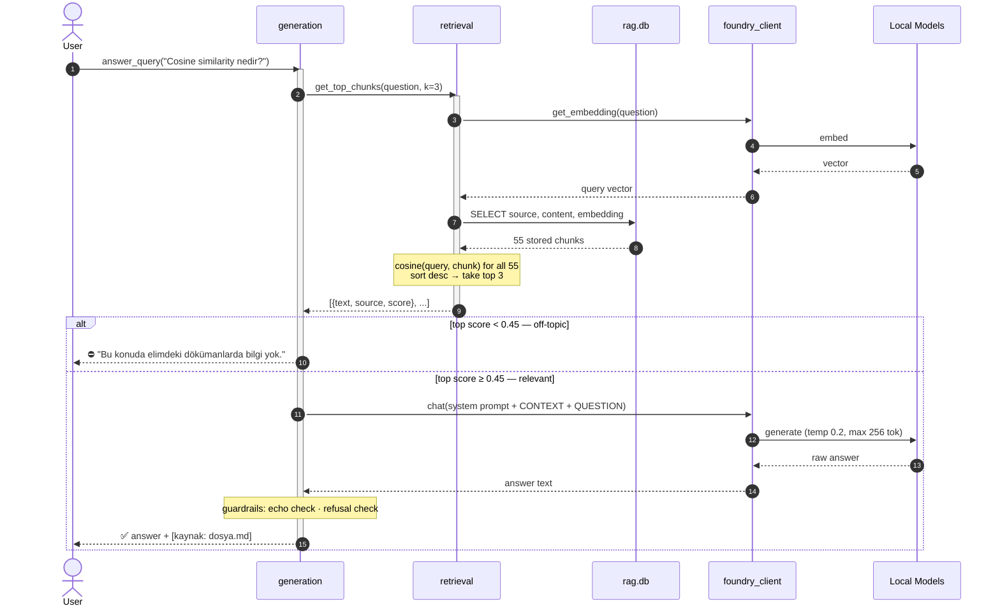
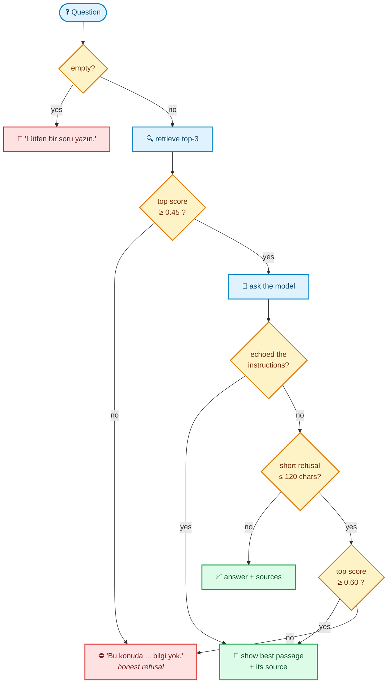
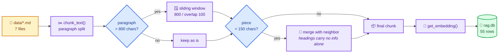
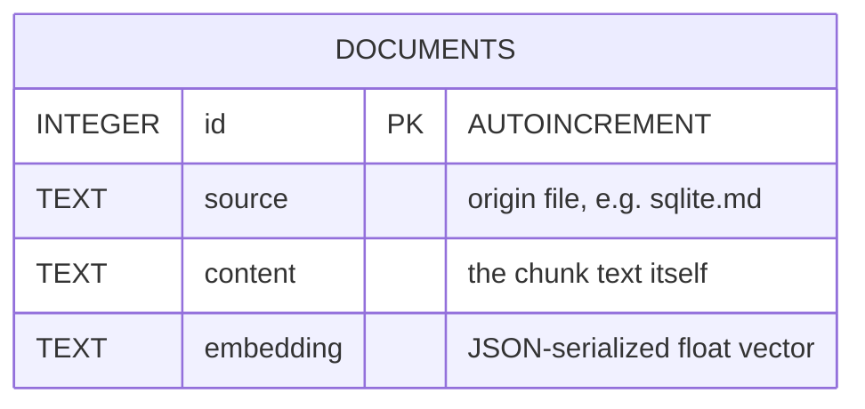
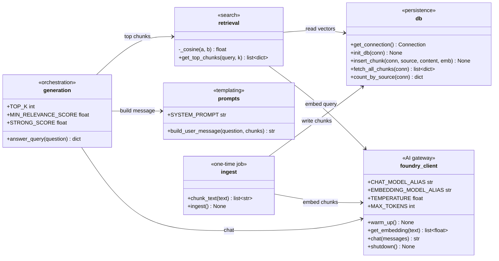

<div align="center">

# 🧠 Local RAG Assistant

### Fully offline document Q&A — no cloud, no API keys, no internet

**Python · Foundry Local · SQLite · Streamlit**

<br/>

[](https://www.python.org/)
[](https://learn.microsoft.com/azure/ai-foundry/foundry-local/)
[](https://www.sqlite.org/)
[](https://streamlit.io/)

[](#-why-local)
[](#-evaluation)
[](#-data-model)
[](#-design-decisions)
[](#-license)
[](#prerequisites)

</div>

---

## 📖 What is this?

This assistant answers questions **only from your own local documents**. It finds the most
relevant passages, injects them into the prompt, and asks an on-device model to write a
source-grounded answer. If the documents don't contain the answer, it says so instead of
making one up.

Everything — the embedding model, the chat model, and the database — runs on your own
machine. After the first model download, you can pull the network cable.

> [!NOTE]
> **Reference article:** [Building Your First Local RAG Application with Foundry Local](https://techcommunity.microsoft.com/blog/azuredevcommunityblog/building-your-first-local-rag-application-with-foundry-local/4501968) · **Teaching plan:** [`docs/one_month_plan.md`](docs/one_month_plan.md)

---

## 🏗️ Architecture

A five-layer design where **every arrow stays inside the machine**.



> [!TIP]
> **The `foundry_client.py` rule:** it is the *only* file that imports the Foundry SDK.
> If the SDK changes, exactly one file needs updating.

---

## 🔄 How a question becomes an answer

UML sequence of a single query — from keystroke to cited answer.



---

## 🛡️ The guardrail gate

The part that keeps the assistant honest. A small on-device model will sometimes echo its
own instructions or give up on a question it *can* answer — both are handled explicitly.



> [!IMPORTANT]
> A refusal is **respected**, not overwritten — unless retrieval was very strong
> (`score ≥ 0.60`), where giving up is a model failure, not a missing document.
> In that case the best passage is shown verbatim with its source. Nothing is ever invented.

---

## 📥 Ingestion pipeline

Run once, and again whenever `data/` changes.



---

## 🗄️ Data model

One table. Embeddings are stored as JSON text — trivially inspectable, no extension needed.



| Source file | Chunks | Topic |
|-------------|:------:|-------|
| `foundry_local.md` | 10 | Installation, model management, hardware support |
| `rag_pipeline.md` | 10 | Ingestion and query phases, step by step |
| `prompt_engineering.md` | 9 | System/user prompts, RAG prompt design, pitfalls |
| `architecture.md` | 8 | This project's five-layer local architecture |
| `embeddings.md` | 7 | Embeddings, cosine similarity, top-K retrieval |
| `rag_nedir.md` | 6 | RAG overview, hallucination, three-step pipeline |
| `sqlite.md` | 5 | SQLite overview, schema, SQL operations, limits |
| **Total** | **55** | |

---

## 🧩 Module contract

Each module exposes a narrow, stable surface. UML class view:



<details>
<summary><b>📜 Interface contract (copy-paste reference)</b></summary>

```python
# foundry_client.py — the only file that touches the Foundry SDK
foundry_client.warm_up()                        -> None
foundry_client.get_embedding(text: str)         -> list[float]
foundry_client.chat(messages: list[dict])       -> str
foundry_client.shutdown()                       -> None

# retrieval.py
retrieval.get_top_chunks(query: str, k: int = 3) -> list[dict]
# [{"text": str, "source": str, "score": float}, ...]

# generation.py
generation.answer_query(question: str)          -> dict
# {"answer": str, "sources": list[str], "used_chunks": list[dict]}
```

</details>

---

## ⚡ Quick Start

### Prerequisites

| Requirement | Notes |
|-------------|-------|
| 🐍 Python 3.10+ | 3.11 recommended |
| 💻 Windows or Apple Silicon Mac | Intel Mac is not supported by Foundry Local |
| 💽 ~4 GB free disk | Model download, first run only |
| 🌐 Internet | First run only — models are cached afterwards |

### Setup

```bash
# 1 — virtual environment
python -m venv .venv
.venv\Scripts\activate          # Windows
source .venv/bin/activate       # macOS / Linux

# 2 — dependencies
pip install -r requirements.txt

# 3 — verify environment, catalog, aliases, data and DB
python check_setup.py
python check_setup.py --models  # list every available model alias

# 4 — "Hello Model" smoke test
python examples/hello_model.py
```

### Run

```bash
python ingest.py                # 1️⃣  build the knowledge base
python main.py                  # 2️⃣  terminal interface
streamlit run ui_streamlit.py   # 2️⃣  …or the web UI
```

Drop your own `.txt` / `.md` files into `data/` and rerun `python ingest.py`.

> [!WARNING]
> `ingest.py` **clears and rebuilds** the `documents` table on every run. There is no
> incremental ingestion — fine at 7 documents, wasteful for a large corpus.

<details>
<summary><b>🔧 Model alias mismatch?</b></summary>

If `check_setup.py` reports a missing alias, edit the top of `foundry_client.py`:

```python
CHAT_MODEL_ALIAS      = "qwen2.5-1.5b"          # or: qwen2.5-0.5b, phi-3.5-mini
EMBEDDING_MODEL_ALIAS = "qwen3-embedding-0.6b"
```

Verify what your machine actually has with `foundry model list`.

</details>

---

## 🎛️ Configuration

Every tunable constant lives at the top of its own file.

| Constant | File | Default | Effect |
|----------|------|:-------:|--------|
| `CHAT_MODEL_ALIAS` | `foundry_client.py` | `qwen2.5-1.5b` | Model that writes the answer |
| `EMBEDDING_MODEL_ALIAS` | `foundry_client.py` | `qwen3-embedding-0.6b` | Model that vectorizes text |
| `TEMPERATURE` | `foundry_client.py` | `0.2` | Answer randomness — low = factual |
| `MAX_TOKENS` | `foundry_client.py` | `256` | Answer length ceiling |
| `TOP_K` | `generation.py` | `3` | Chunks pulled per query |
| `MIN_RELEVANCE_SCORE` | `generation.py` | `0.45` | Below this → honest refusal |
| `STRONG_SCORE` | `generation.py` | `0.60` | Above this → trust retrieval over a model give-up |
| `MAX_CHARS` | `ingest.py` | `800` | Target chunk size |
| `OVERLAP` | `ingest.py` | `100` | Overlap when splitting a long paragraph |
| `MIN_CHARS` | `ingest.py` | `150` | Shorter pieces merge with their neighbor |

---

## 🧪 Evaluation

```bash
python eval/run_eval.py              # all 26 questions
python eval/run_eval.py --verbose    # print full answers
python eval/run_eval.py --fail-only  # only the failures
```

Every run writes a persistent report to [`eval/results.md`](eval/results.md) — per-question
PASS/FAIL, timing and cited sources.

<div align="center">

| Category | Count | Result | What it checks |
|----------|:-----:|:------:|----------------|
| 🟢 Answerable | 18 | 14 ✅ / 4 ❌ | Answers from the docs and cites the source |
| 🔵 Unanswerable | 4 | 4 ✅ | Refuses instead of hallucinating |
| 🟣 Edge cases | 4 | 4 ✅ | Empty, one-word, vague, very long — no crash |
| **Total** | **26** | **22 / 26 · 85%** | avg **44.5 s** per question, CPU-only laptop |

</div>

<details>
<summary><b>🔎 Known weak spots &amp; the improvement list</b></summary>

- **Keyword grading is too strict.** The 1.5B model paraphrases instead of using the literal
  expected token — it explains hardware acceleration without the word *"GPU"*, or describes
  the threshold without quoting *"0.45"*. All 4 failures are of this kind.
  → *Next:* accept multiple keywords per question, or grade with a second model pass.
- **Rare refusal on an answerable question** (run-to-run variance even at `TEMPERATURE=0.2`).
  The `STRONG_SCORE` passage fallback covers most of these.
  → *Next:* retry once on refusal.
- **Larger merged chunks improved grounding but raised latency** on CPU.
  → *Next:* trim to top-2 chunks for short questions, or run on NPU/GPU.

</details>

---

## 🧭 Design decisions

<table>
<tr><td width="34%"><b>🔢 Brute-force cosine, no vector DB</b></td>
<td>For a 5–10 document corpus, comparing the query vector against all 55 stored vectors in
pure Python is fast and needs zero extra dependencies. A vector index only pays off in the
thousands.</td></tr>

<tr><td><b>💾 Plain <code>sqlite3</code></b></td>
<td>Single file, serverless, cross-platform — the right shape for a single-user local app.
Embeddings as JSON text keep the DB inspectable with any SQLite browser.</td></tr>

<tr><td><b>✂️ Paragraph-based chunking</b></td>
<td>Paragraphs keep semantic units intact; the 100-char overlap prevents context loss when a
long paragraph is split mid-thought. Sub-150-char pieces merge upward so bare headings can't
win retrieval while carrying no information.</td></tr>

<tr><td><b>🎯 <code>TOP_K=3</code> with a relevance gate</b></td>
<td>Off-topic questions fall below <code>0.45</code> and get an honest "I don't have that"
instead of a fabrication — the single most important behavior in the system.</td></tr>

<tr><td><b>🐇 Small models, measured</b></td>
<td>On this project's test machine <code>qwen2.5-0.5b</code> was faster but too weak in
Turkish, and <code>phi-3.5-mini</code> took ~2 min/answer on CPU. <code>qwen2.5-1.5b</code> is
the measured sweet spot. Both models warm up at startup, so the first question is as fast as
the rest.</td></tr>
</table>

### Limitations

- Answer depth is bounded by a ~1.5B on-device model — subtle multi-step reasoning stays shallow.
- No incremental ingestion; the table is rebuilt on every run.
- Brute-force retrieval scales linearly with chunk count.
- SQLite here is single-user — no concurrent writers.
- Foundry Local does not support Intel Macs.
- Bilingual prompting can occasionally produce mixed-language answers with very small models.

---

## 📂 Project layout

```text
rag-assistant/
├── 🤖 foundry_client.py     # the ONLY Foundry SDK touch point
├── 💾 db.py                 # SQLite schema + helpers
├── 📥 ingest.py             # read → chunk → embed → store
├── 🔍 retrieval.py          # embed query → cosine → top-K
├── 💬 prompts.py            # system prompt + context builder
├── ⚙️ generation.py         # answer_query() pipeline + guardrails
├── 🖥️ main.py               # CLI Q&A loop
├── 🎨 ui_streamlit.py       # web UI with sidebar + debug panel
├── ✅ check_setup.py        # environment / catalog / data / DB checker
├── 📊 eval/
│   ├── questions.yaml       # 26 test questions
│   ├── run_eval.py          # runner with timing + report writer
│   └── results.md           # recorded run
├── 🎓 examples/
│   ├── hello_model.py       # week 1 — runtime smoke test
│   ├── embedding_demo.py    # week 2 — embeddings + cosine in memory
│   └── sql_sandbox.py       # week 2 — SQLite with the project schema
├── 📚 docs/
│   ├── one_month_plan.md
│   ├── week_by_week_schedule.md
│   └── presentation_outline.md
└── 📄 data/*.md             # 7 knowledge base documents
```

---

## 🔒 Why local?

<div align="center">

| | Cloud RAG | **This project** |
|---|---|---|
| 🌐 Internet | required per query | first download only |
| 🔑 API keys | required | none |
| 💰 Cost per query | metered | zero |
| 🗝️ Where your documents go | a vendor's servers | **your disk** |
| ⏱️ Latency | network round trip | local compute |

</div>

---

## ✅ Definition of Done

- [x] `python check_setup.py` passes with no errors
- [x] `python ingest.py` creates chunks in `rag.db`
- [x] CLI and Streamlit both return grounded answers with sources
- [x] Unanswerable questions get a fallback response — no hallucination
- [x] `python eval/run_eval.py` runs and results are recorded in `eval/results.md`
- [x] `README.md` documents architecture, decisions and limitations
- [ ] Final demo rehearsed on the target machine

---

## 📄 License

MIT — a teaching sample built for learning and experimentation.

<div align="center">
<br/>
<sub>Built to run entirely on your own machine. 🔌</sub>
</div>
